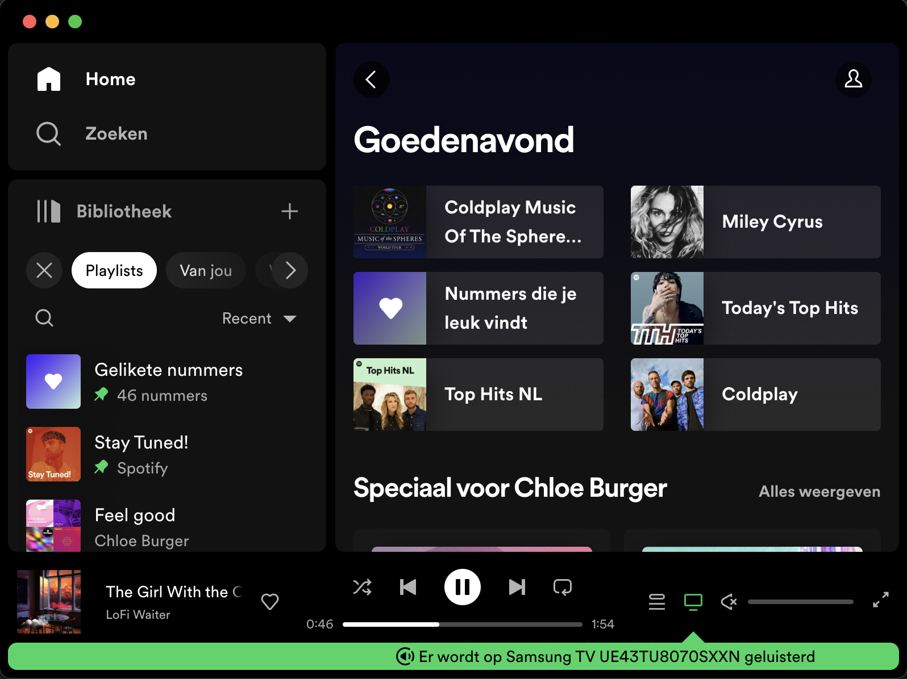

# Procesverslag
Markdown is een simpele manier om HTML te schrijven.  
Markdown cheat cheet: [Hulp bij het schrijven van Markdown](https://github.com/adam-p/markdown-here/wiki/Markdown-Cheatsheet).

Nb. De standaardstructuur en de spartaanse opmaak van de README.md zijn helemaal prima. Het gaat om de inhoud van je procesverslag. Besteedt de tijd voor pracht en praal aan je website.

Nb. Door *open* toe te voegen aan een *details* element kun je deze standaard open zetten. Fijn om dat steeds voor de relevante stuk(ken) te doen.

## Jij

  
uitwerken voor kick-off werkgroep

  ### Auteur:
  Chloé Burger

  #### Je startniveau:
  blauw/rood

  #### Je focus:
  responsiveness
 

## Je website

  
uitwerken voor kick-off werkgroep

  ### Je opdracht:
  Spotify app

  #### Screenshot(s) van de eerste pagina (small screen): Zoekopdrachten-pagina
  

  #### Screenshot(s) van de tweede pagina (small screen): Home-pagina 
  

## Toegankelijkheidstest 1/2 (week 1)

  
uitwerken na test in 2e werkgroep

  ### Bevindingen
  Lijst met je bevindingen die in de test naar voren kwamen:

  - Voiceover kan niet goed gebruikt worden op spotify doordat de hierarchie in de app niet duidelijk is.
  - Contrast niveau is goed 18.88
  - Bij de verschillende vision emulations blijft er alsnog een duidelijk beeld van de website. de website blijft toegangkelijk voor mensen die kleuren niet goed kunnen onderscheiden of slecht contrast zien.

  #### Screenshot(s) van de vision emulation (big screen): Zoekopdrachten-pagina 
  

  #### Screenshot(s) van de tweede pagina (small screen): Zoekopdrachten-pagina
  

## Breakdownschets (week 1)

  
uitwerken na afloop 3e werkgroep

  ### de hele pagina: 
  

  ### dynamisch deel (bijv menu): 
  
</detail>

## Voortgang 1 (week 2)

  
uitwerken voor 1e voortgang

  ### Stand van zaken
  De layout toepassen ging naar mijn mening wel goed.
  

  Ik heb nog wel moeite om de juiste ul aan te moeten spreken omdat het er veel zijn.
  Ik wil dit graag op een logischere manier direct kunnen aanspreken zodat de code niet rommelig is.
  Hieronder foto's van de code:

  

  

  ### Agenda voor meeting
  samen met je groepje opstellen

  #### Donna:
  - Hoe je een menu eruit laat komen ook alweer als je erop klikt

  #### Chloé
  - Opmaak van menu zou ik in html zetten?
  - Hoe kan ik van een <h3> een link maken die niet linkt naar een pagina?
  - Hoe kan ik de <li> juist aanspreken om flexbasis en flexgrow toe te passen?

  #### Malik:
  -  Hoe moet ik het hamburger menu uitwerken?

  #### Jaouad:
  - Onduidelijkheid hoe ik een stuk van een bepaald deel van de content in moet delen in html.
  - Vraag of iets een 
 of <h3> is?
  - Hulp nodig bij de media querries! Waar begin je?

  ### Verslag van meeting
  hier na afloop snel de uitkomsten van de meeting vastleggen
  - De opmaak van het menu kan het beste opgemaakt owedne uit 2 verschillende <nav>'s aan de hand daarvan kan je met grid weer verder werken om de juiste layout te maken.
  - Ik merk nog dat ik moeitte heb om de juiste elementen aan te spreken. Dit gaat wel al steeds wat beter. Wel weet ik hoe ik de jsuitse html moet schrijven en in welke volgorde dit dan is.

## Voortgang 2 (week 3)

  
uitwerken voor 2e voortgang

  ### Stand van zaken
  - Nog problemen met het grid gehad. lukt niet helemaal om de juiste elementen aan te spreken of verkeerd te flexen.
  ### Agenda voor meeting

 #### Donna:
  - Hoe krijg je een font want niet online beschikbaar is erin?
  - De hele pagina de goede grootte maken.
  - Menu in en uit laten klappen.

  #### Chloé
  - Hoe zorg ik ervoor dat mijn <form> de juiste grote is aan de hand van grid?

  #### Malik:
  - Hoe zorg ik ervoor dat mijn gehele pagina, op uitzondering van één element dezelfde padding krijgt?
  - Hoe zorg ik ervoor dat EM juist wordt vertaald naar PX?

  #### Jaouad:
  - Loop helemaal vast met CSS.
  - Zijwaarts scrollen voorkomen.
  - Positionering van content.
  - Custom font pakt hij niet.
  - Afbeeldingen sizen naar section/grid?
  - Position absolute/relative gaat niet goed.

  ### Verslag van meeting
  - Aan de hand van de feedback weet ik dat ik alleen de waarde in de formule moet aanpassen om zo de form te voorschijn te krijgen. 
  - Ik weet nu ook hoe ik font's online kan kopieren aan de hand van fallback-fonts.

## Toegankelijkheidstest 2/2 (week 4)

  
uitwerken na test in 9e werkgroep

  ### Bevindingen
  - Responsiveness nog niet goed genoeg, content is niet altijd volledig zichtbaar.
  - Mist een lightmodus.
  - De Voice-overmodus is toepasbaar en er kan genavigeerd worden.

## Voortgang 3 (week 4)

  
uitwerken voor 3e voortgang

  ### Stand van zaken
  hier dit ging goed & dit was lastig (neem ook screenshots op van delen van je website en code)

  ### Agenda voor meeting
  samen met je groepje opstellen

  #### Donna:
  - Hoe krijg ik een uitklapbare lijst in een hamburger menu?

  #### Chloé
  - Hoe kan ik in de main ervoor zorgen dat de < li > in de tweede < ul > flex-direction column geeft zonder dat de foto van grote verandert?
  - Hoe zorg ik ervoor dat de overflow scroll alleen in de playlist is en niet in de hele header?
  - Moet ik voor de @media Hidden gebruiken of de breedte aangeven of moet dit gecombineerd?

  #### Malik:
  - Hoe kan ik ervoor zorgen dat mijn H3 met een absolute positioning mee schaalt, zodat het responsive is?
  - Hoe kan ik ervoor zorgen dat een section met list items alleen mee schaalt in de breedte en niet in de hoogte?

  #### Jaouad:
  <!-- was er niet bij -->

 ### Verslag van meeting
  - Door de foto een width te geven van 100% verandert de foto niet van grote. 
  - Overflow scroll is goed toegepast , ik had alleen de verkeerde ul aangesproken.
  - Media queary gebruiken met breedtes op responsive te scallen van de pagina.

## Eindgesprek (week 5)

  
uitwerken voor eindgesprek

  ### Je uitkomst - karakteristiek screenshots:
  
  
  

  ### Dit ging goed/Heb ik geleerd: 
  - Ik heb geleerd om aan de hand van veel selectoren de juiste en tegelijk meerdere elementen aan te spreken in de html.
  

  - Ik snap nu wat beter hoe display flex en grid werken. en heb dit zelf ook gepbrobeerd toe te passen.
  

  - Ik merk dat het coderen veel beter gaat dan eerst! soms! Vaak zie ik het even niet en dan probeer ik wat andere opties. 
  - Vaak had ik de oplossing bijna goed en gaf dat mij voldoening dat ik enigszins wel begrijp wat ik aan het coderen ben.
  - Ik snap @media nu en kan het zelf toepassen!
  

  

  ### Dit was lastig/Is niet gelukt:
  Korte omschrijving met plaatjes
  - Voor de <form> heb ik veel moeite gehad om de buttons juist te flexen en juist te verdelen als er responsive wordt gehandelt
  

  - Voor de tweede pagina is het me niet gelukt de eerste <ul> uit de main te verbergen zonder dat alles kapot gaat.

## Bronnenlijst

  
continu bijhouden terwijl je werkt

  bron 1 stackoverflow bij <forum> @media
  

