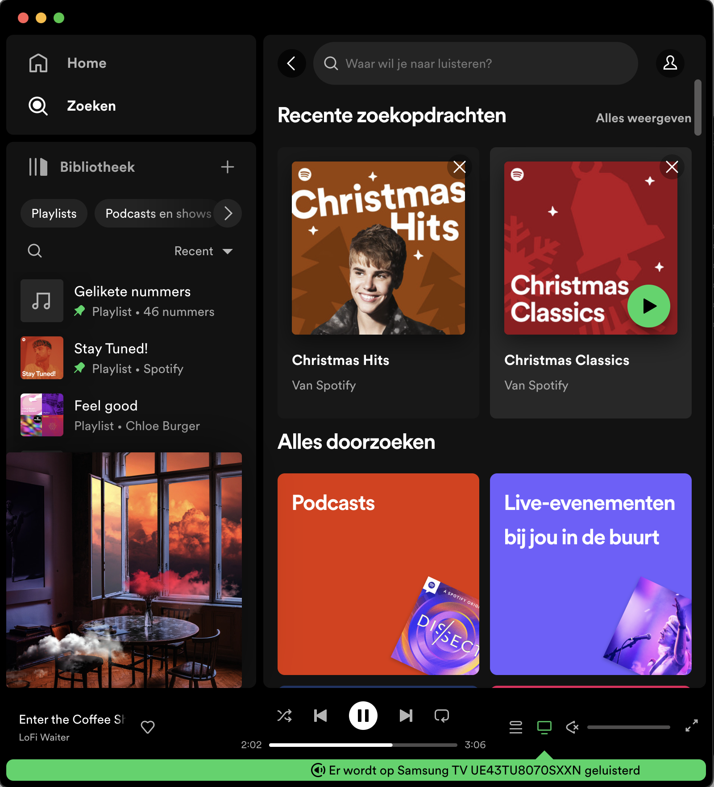
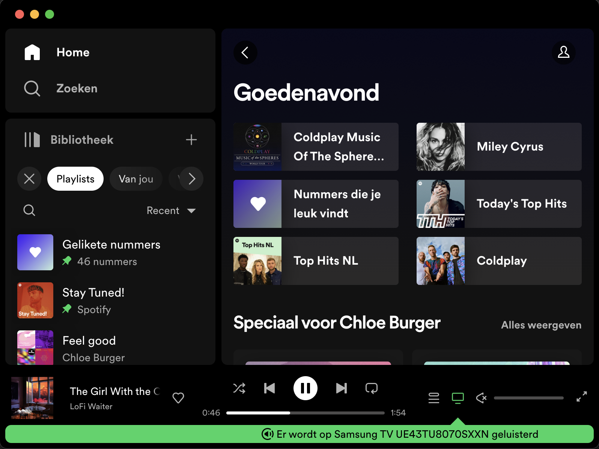
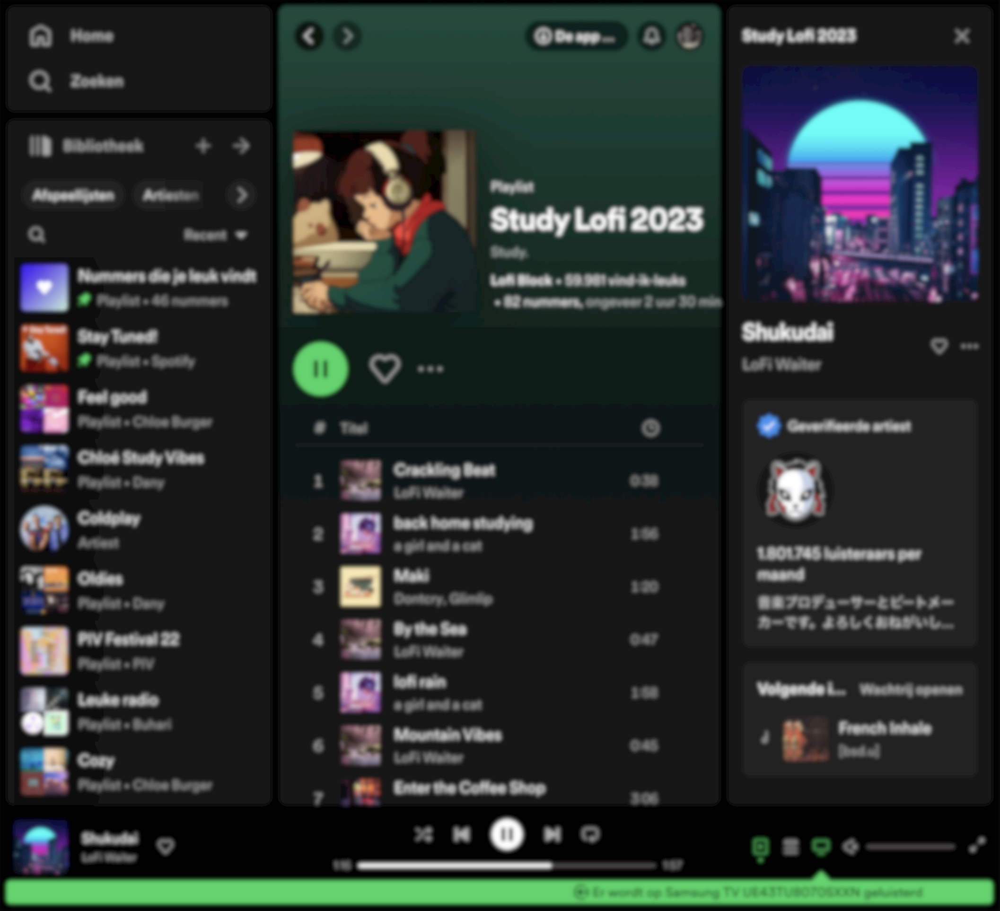
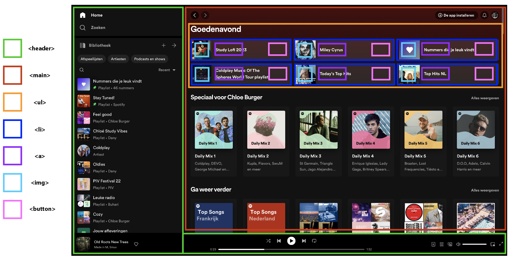
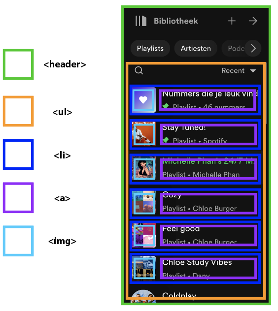
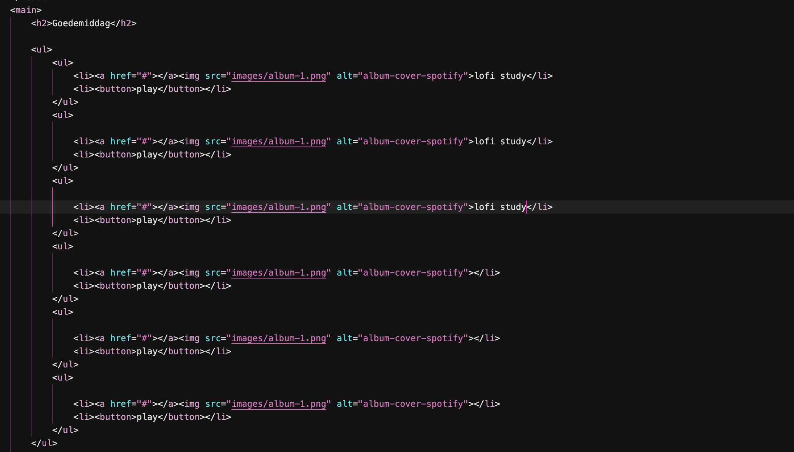
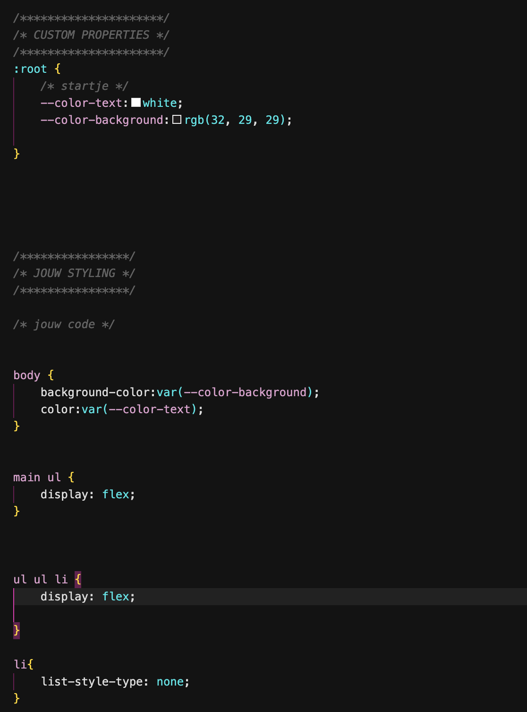

# Procesverslag
Markdown is een simpele manier om HTML te schrijven.  
Markdown cheat cheet: [Hulp bij het schrijven van Markdown](https://github.com/adam-p/markdown-here/wiki/Markdown-Cheatsheet).

Nb. De standaardstructuur en de spartaanse opmaak van de README.md zijn helemaal prima. Het gaat om de inhoud van je procesverslag. Besteedt de tijd voor pracht en praal aan je website.

Nb. Door *open* toe te voegen aan een *details* element kun je deze standaard open zetten. Fijn om dat steeds voor de relevante stuk(ken) te doen.

## Jij

  
uitwerken voor kick-off werkgroep

  ### Auteur:
  Chloé Burger

  #### Je startniveau:
  blauw/rood

  #### Je focus:
  responsiveness
 

## Je website

  
uitwerken voor kick-off werkgroep

  ### Je opdracht:
  Spotify app

  #### Screenshot(s) van de eerste pagina (small screen): Zoekopdrachten-pagina
  

  #### Screenshot(s) van de tweede pagina (small screen): Home-pagina 
  
 

## Toegankelijkheidstest 1/2 (week 1)

  
uitwerken na test in 2e werkgroep

  ### Bevindingen
  Lijst met je bevindingen die in de test naar voren kwamen:

  - Voiceover kan niet goed gebruikt worden op spotify doordat de hierarchie in de app niet duidelijk is.
  - Contrast niveau is goed 18.88
  - Bij de verschillende vision emulations blijft er alsnog een duidelijk beeld van de website. de website blijft toegangkelijk voor mensen die kleuren niet goed kunnen onderscheiden of slecht contrast zien.

  #### Screenshot(s) van de vision emulation (big screen): Zoekopdrachten-pagina 
  

  #### Screenshot(s) van de tweede pagina (small screen): Zoekopdrachten-pagina
  
 

## Breakdownschets (week 1)

  
uitwerken na afloop 3e werkgroep

  ### de hele pagina: 
  

  ### dynamisch deel (bijv menu): 
  

  ### wellicht nog een dynamisch deel (bijv filter): 
  

## Voortgang 1 (week 2)

  
uitwerken voor 1e voortgang

  ### Stand van zaken
  De layout toepassen ging naar mijn mening wel goed.
  

  Ik heb nog wel moeite om de juiste ul aan te moeten spreken omdat het er veel zijn.
  Ik wil dit graag op een logischere manier direct kunnen aanspreken zodat de code niet rommelig is.
  Hieronder foto's van de code:

  

  

  ### Agenda voor meeting
  samen met je groepje opstellen

#### Donna:
- Hoe je een menu eruit laat komen ook alweer als je erop klikt

#### Chloé
- Opmaak van menu zou ik in html zetten?
- Hoe kan ik van een <h3> een link maken die niet linkt naar een pagina?
- Hoe kan ik de <li> juist aanspreken om flexbasis en flexgrow toe te passen?

#### Malik:
-  Hoe moet ik het hamburger menu uitwerken?

#### Jaouad:
- Onduidelijkheid hoe ik een stuk van een bepaald deel van de content in moet delen in html.
- Vraag of iets een 
 of <h3> is?
- Hulp nodig bij de media querries! Waar begin je?

### Verslag van meeting
  hier na afloop snel de uitkomsten van de meeting vastleggen

  - punt 1
  - punt 2
  - nog een punt
  - ...

## Voortgang 2 (week 3)

  
uitwerken voor 2e voortgang

  ### Stand van zaken
  De layout toepassen ging naar mijn mening wel goed.
  Ik heb nog wel moeite om de juiste ul aan te moeten spreken omdat het er veel zijn.
  Ik wil dit graag op een logischere manier direct kunnen aanspreken zodat de code niet rommelig is.
  
  

  ### Agenda voor meeting
  samen met je groepje opstellen

  | student 1      | student 2          | student 3    | student 4        |
  | ---            | ---                | ---          | ---              |
  | dit bespreken  | en dit             | en ik dit    | en dan ik dat    |
  | en dat ook nog | dit als er tijd is | nog een punt | dit wil ik zeker |
  | ...            | ...                | ...          | ...              |

  ### Verslag van meeting
  hier na afloop snel de uitkomsten van de meeting vastleggen

  - punt 1
  - punt 2
  - nog een punt
- ...

## Toegankelijkheidstest 2/2 (week 4)

  
uitwerken na test in 9e werkgroep

  ### Bevindingen
  Lijst met je bevindingen die in de test naar voren kwamen (geef ook aan wat er verbeterd is):

## Voortgang 3 (week 4)

  
uitwerken voor 3e voortgang

  ### Stand van zaken
  hier dit ging goed & dit was lastig (neem ook screenshots op van delen van je website en code)

  ### Agenda voor meeting
  samen met je groepje opstellen

  | student 1      | student 2          | student 3    | student 4        |
  | ---            | ---                | ---          | ---              |
  | dit bespreken  | en dit             | en ik dit    | en dan ik dat    |
  | en dat ook nog | dit als er tijd is | nog een punt | dit wil ik zeker |
  | ...            | ...                | ...          | ...              |

  ### Verslag van meeting
  hier na afloop snel de uitkomsten van de meeting vastleggen

  - punt 1
  - punt 2
  - nog een punt
  - ...

## Eindgesprek (week 5)

  
uitwerken voor eindgesprek

  ### Je uitkomst - karakteristiek screenshots:
  

  ### Dit ging goed/Heb ik geleerd: 
  Korte omschrijving met plaatjes

  

  ### Dit was lastig/Is niet gelukt:
  Korte omschrijving met plaatjes

  

## Bronnenlijst

  
continu bijhouden terwijl je werkt

  Nb. Wees specifiek ('css-tricks' als bron is bijv. niet specifiek genoeg). 
  Nb. ChatGpT en andere AI horen er ook bij.
  Nb. Vermeld de bronnen ook in je code.

  1. bron 1
  2. bron 2
  3. ...

